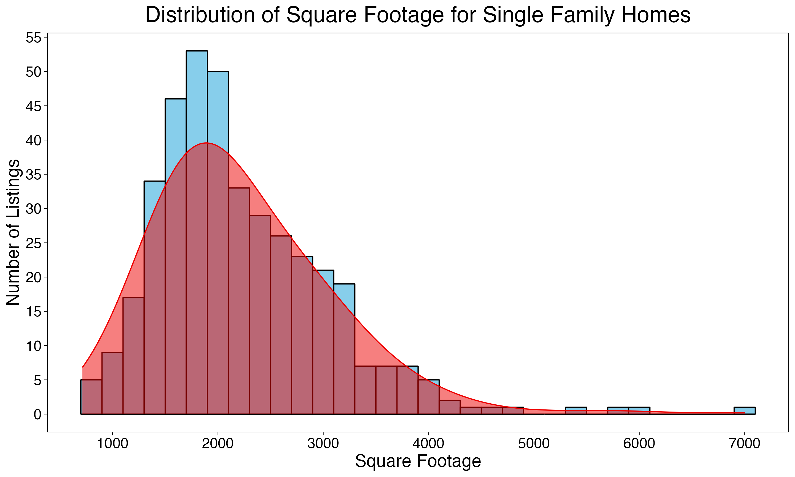
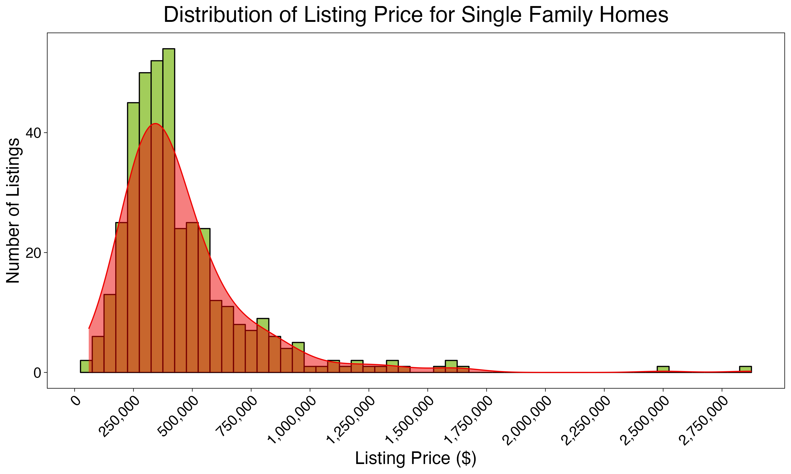
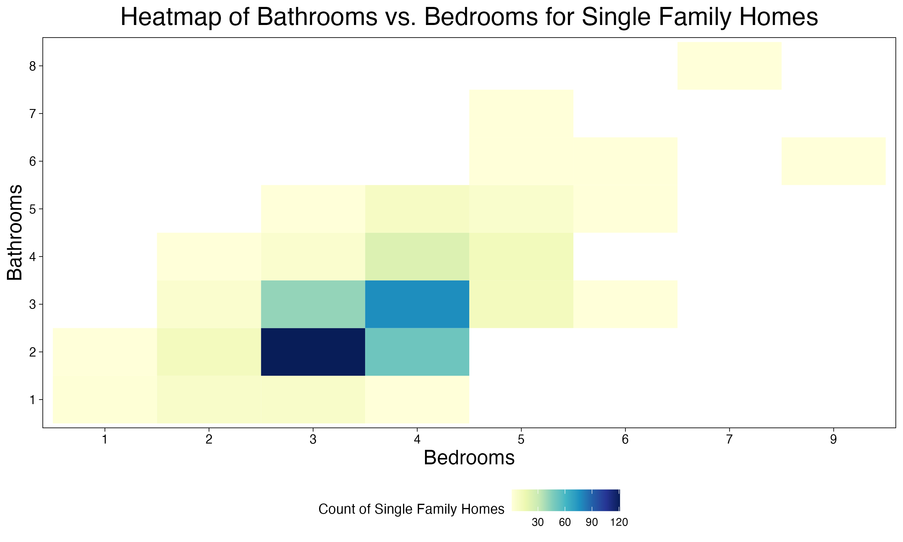

# Visualizing Texas Real Estate Trends 2024: 500 Listings 🏠

- [Kaggle Data Source](https://www.kaggle.com/datasets/kanchana1990/texas-real-estate-trends-2024-500-listings/data)

This project aims to explore what the average single-family home in Texas could look like through data visualization.

Data Bias:
- According to the source, this dataset features “a curated selection of 500 property listings. It encompasses a wide array of properties, reflecting the diverse real estate landscape across Texas”, which indicates that there is some bias with the data selection.

## Data Exploration

